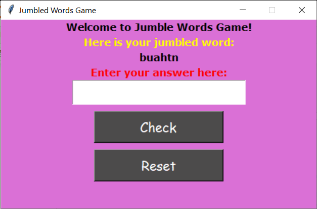

# Python Tkinter Projects Covered
The repository covers the following projects:
1. A Simple Email Slicer
2. Jumble Words Game
3. A Simple Login and Sign-Up System
4. A Simple To-Do List

## Project 1: A Simple Email Slicer
The <b>email slicer</b> is a quite handy program to get the <b>username and domain name</b> from an email address. The images below show the screenshots of the same project built:
| ||
| ------------- |:-------------:|

## Project 2: Jumble Words Game
Jumble Word Game is a game where you find the correct word from a scrambled set of letters. You need to use all the given letters. The image below shows the screenshots of the same project built:

## Project 3: A simple Login and Sign-Up System
The System takes your username and password and provides you with login and sign-up button. The usernames and passwords are stored in separate files.

It is not perfect but there are a few constraints set:
1. Username or password can't be empty
2. Username needs to be unique

The image below shows the screenshots of the same project built:

## Project 4: A simple To-Do List
The System aims at storing all your daily tasks or important ideas.
